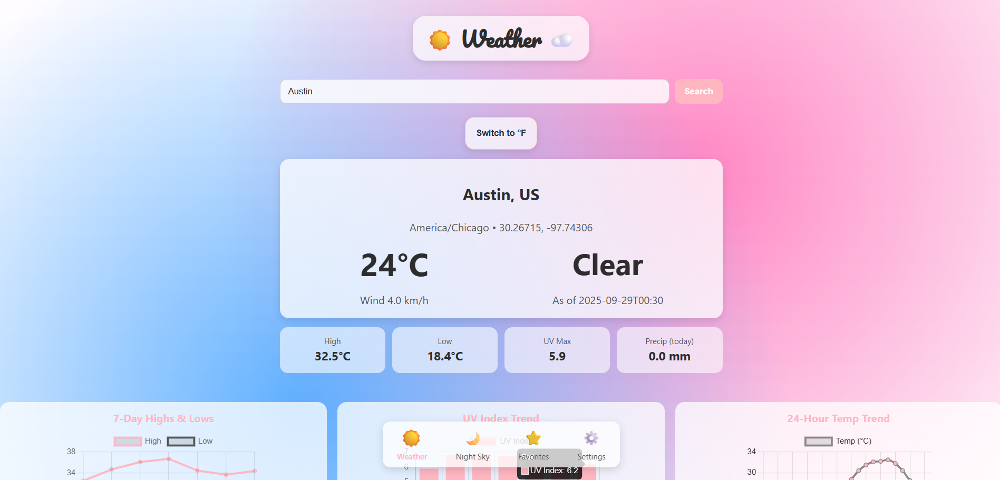
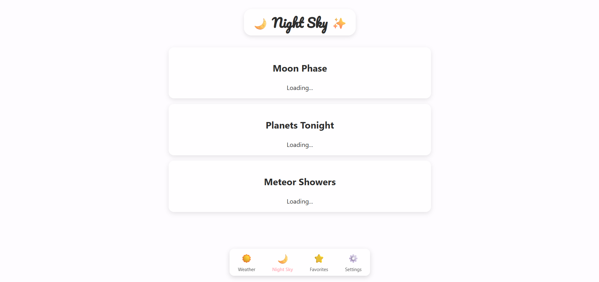
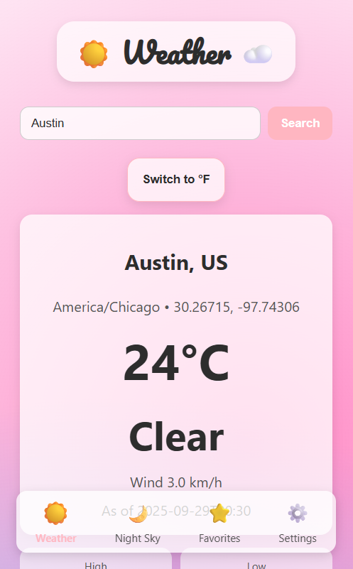
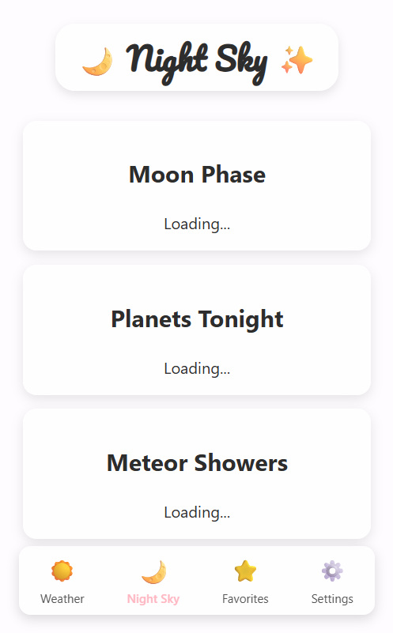

# 🌦️ Weather & Night Sky Web App

This project is a Flask-based web application that combines real-time weather forecasting with basic astronomy insights in a clean, responsive interface.

## Screenshots of Current Look

## 🔑 Features

### Weather Dashboard (`/`)
- Users can search for any city/place.  
- Integrates with the Open-Meteo API to display:  
  - Current temperature, wind, conditions  
  - Today’s high, low, UV index, and precipitation  
  - 7-day forecast highs/lows  
  - Hourly temperature trend (24 hours)  
  - UV index trend  
- Includes an interactive °C ↔ °F toggle that updates both the display and charts.  
- Background gradient dynamically shifts based on current temperature.  

### Night Sky Dashboard (`/night`)
- Designed to display:  
  - Current moon phase and rise/set times  
  - Visible planets tonight  
  - Upcoming meteor showers  
- Currently uses placeholders, but ready to integrate with astronomy APIs (Open-Meteo Astronomy API, ipgeolocation.io, or NASA datasets).  

### Consistent UI/UX
- Shared bottom navigation bar with icons for Weather, Night Sky, Favorites, and Settings.  
- Responsive design (mobile and desktop layouts) with CSS grid for forecasts and charts.  
- Playful but polished aesthetic using a pastel pink accent (`--accent`), card components, and the Pacifico title font.  

## ⚙️ Tech Stack
- **Backend**: Flask (Python)  
- **Frontend**: HTML5, Jinja2 templates, CSS (custom, responsive, themed)  
- **Charts**: Chart.js for data visualization  
- **APIs**: Open-Meteo Geocoding + Weather API (live) and Astronomy API (to be added)  

## 🚀 Future Enhancements
- Add live astronomy data (moon phase, planets, meteors).  
- Let users save favorite locations.  
- Add Settings (units, themes, default city).  
- Expand meteor shower data (link to NASA or IMO datasets).  

